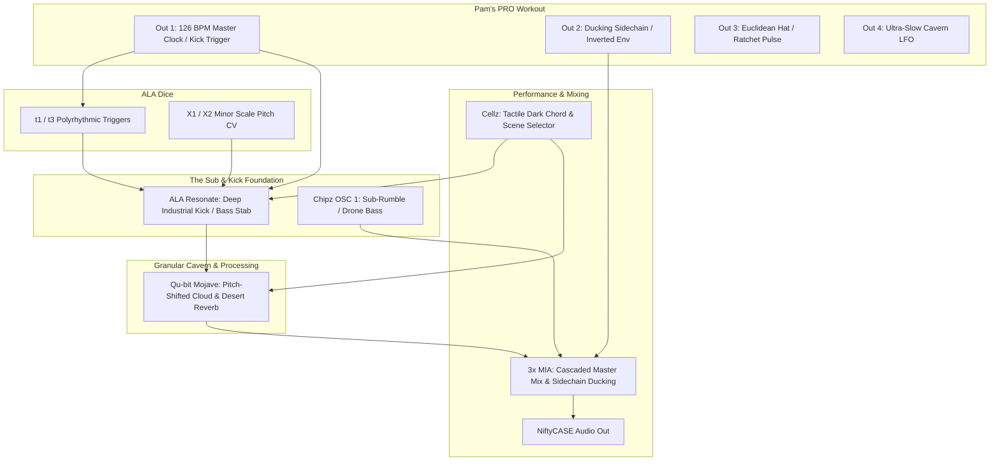
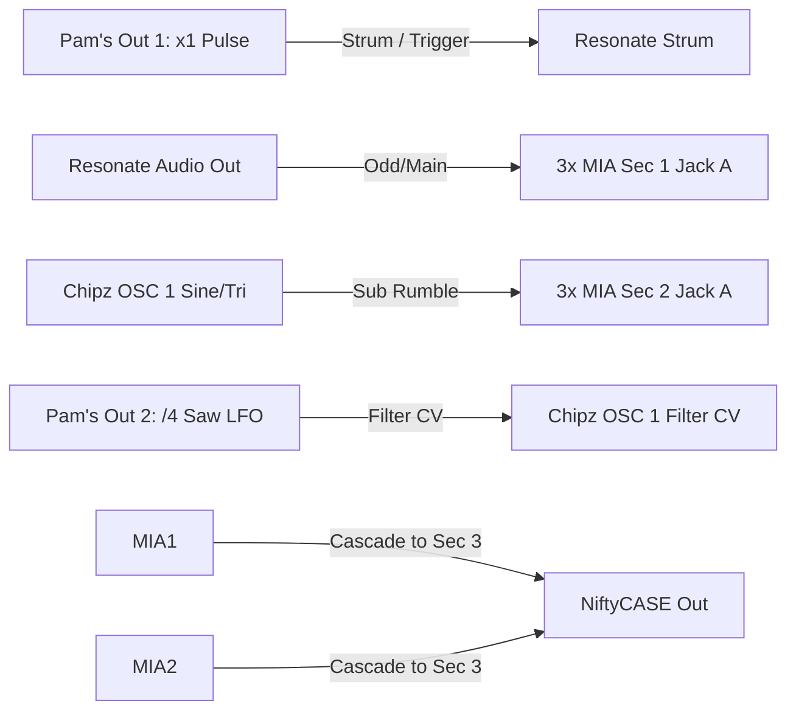
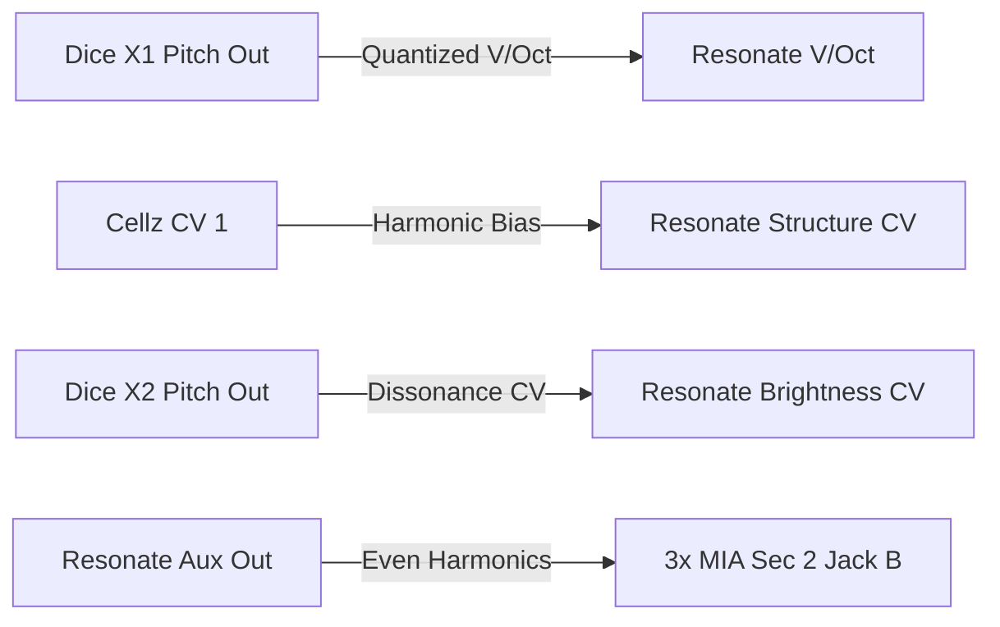
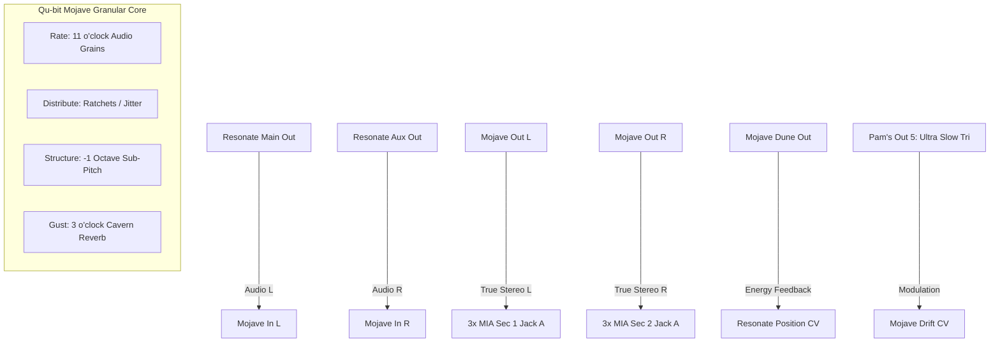
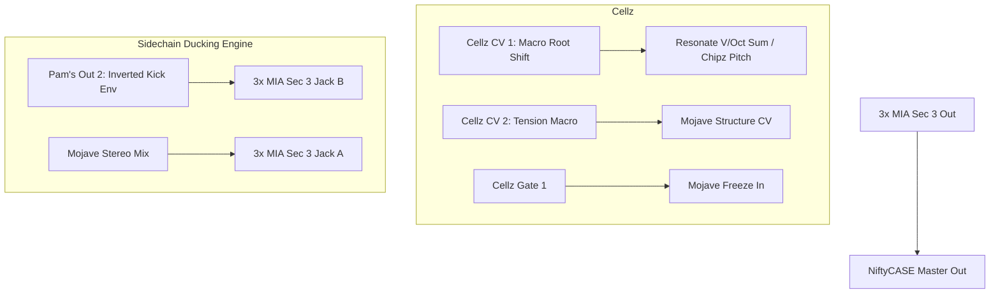

# 5-Day Patch Plan: Dark Ambient Techno (84HP)

Welcome to the **Dark Ambient Techno Masterclass**. This 5-day build transforms your 84HP system into a self-contained, brooding industrial powerhouse. 

Dark ambient techno merges the hypnotic, cavernous spaces of ambient with the relentless, subterranean drive of Berlin/industrial minimal techno (think *Rrose, Andy Stott, Kangding Ray, Lucy, Plastikman, Shifted*).

---

## Sonic Architecture & Gear Allocation



---

## Day 1: The Subterranean Pulse (Industrial Kick & Sub-Rumble)

**Musical Objective:** Establish the bedrock of dark techno: a heavy, pitch-decayed industrial kick paired with a low-end sub-drone that vibrates under the track.



### 1. The Industrial Kick (Resonate in Modal Drum Mode)
Resonate's modal synthesis engine creates extraordinary sub-kicks and industrial percussion when tuned low and choked with short damping.
* **Patch:** Connect **Pam's Output 1** $\rightarrow$ **ALA Resonate Strum**.
* **Setup (Pam's):** 
  * Set BPM to **126**.
  * Set Output 1 Modifier to **x1** (standard 4/4 quarter-note pulse).
  * Width: **50%**.
* **Tweak (Resonate):**
  * **Model Button:** Set to **Green** (Modal Resonator).
  * **Frequency (Pitch):** Turn down to **9 o'clock** (deep, chest-thumping sub-frequency).
  * **Structure:** Set to **8 o'clock** (pure, dense fundamental with minimal high harmonics).
  * **Brightness:** Set to **10 o'clock** (removes clicky top-end for a dark, rounded thump).
  * **Damping:** Set to **10 o'clock** (tight, short decay with instant low-end punch).

### 2. The Dark Sub-Rumble (Chipz OSC 1)
Dark techno tracks rarely have dead silence between kicks; they feature a muddy, rolling low-end rumble.
* **Patch:** Connect **Chipz OSC 1 Out** $\rightarrow$ **3x MIA Section 2 Jack A**.
* **Patch:** Connect **Pam's Output 2** $\rightarrow$ **Chipz OSC 1 Filter CV In**.
* **Setup (Pam's):** Set Output 2 to **`/4`** modifier, Waveform: **Saw / Ramp** (creates a rhythmic sweeping low filter swell).
* **Tweak (Chipz):** 
  * Tune OSC 1 way down until it locks into sub-bass territory (~40–60 Hz).
  * Set the **Filter** knob to around **9–10 o'clock** so only warm sub frequencies pass through.

### 3. Route and Cascade Master Audio (3x MIA)
* **Patch:** Connect **ALA Resonate Out** $\rightarrow$ **3x MIA Section 1 Jack A**.
* **Patch:** Leave Section 1 Out **unpatched** (cascades into Section 2).
* **Patch:** Leave Section 2 Out **unpatched** (cascades into Section 3).
* **Patch:** Connect **3x MIA Section 3 Out** $\rightarrow$ **NiftyCASE Audio Out**.
* **Levels:**
  * **Section 1 Knob A (Kick):** 1 o'clock.
  * **Section 2 Knob A (Sub Rumble):** 10 o'clock (subtle, warm foundation).

> [!TIP]
> **Daily Habit (5 Mins):** Turn down room lights. Listen to the kick and sub-rumble interact. Adjust Resonate's **Damping** until the kick hits with punch without muddying the sub. **Leave patched for Day 2!**

---

## Day 2: Skeletal Polyrhythms & Rattling Percussion (Dice & Pam's)

**Musical Objective:** Introduce skittering, hypnotic, off-kilter percussion and micro-rhythms using **ALA Dice (Marbles)** and Pam's Euclidean generators.

```mermaid
graph LR
    PamsClock[Pam's Out 3: x2 Clock] -->|Clock In| DiceClock[Dice Clock t]
    DiceT1[Dice t1 Trigger] -->|Poly-trigger| ResStrum[Resonate Strum (Swap)]
    DiceT3[Dice t3 Trigger] -->|Sync/Accent| CellzClock[Cellz Clock In]
    Chipz2[Chipz OSC 2 Square] -->|Metallic Click| MIA1B[3x MIA Sec 1 Jack B]
    Pams4[Pam's Out 4: Euclidean] -->|V/Oct Sync| Chipz2Pitch[Chipz OSC 2 Pitch CV]
```

### 1. Clocking Dice into Hypnotic Loops
* **Patch:** Connect **Pam's Output 3** $\rightarrow$ **ALA Dice Clock In (t)**.
* **Setup (Pam's):** Set Output 3 to **x2** (eighth-note pulse) or **x4** (sixteenth-note clock).
* **Tweak (Dice t-section):**
  * Set **Rate:** 12 o'clock (locked to external clock).
  * Set **Bias:** 11 o'clock (slightly favours $t_1$ over $t_3$).
  * Set **Jitter / Deja Vu (t):** 1 o'clock (creates a repeating 16-step rhythm that occasionally glitches or drops a ghost hit).

### 2. The Metallic Skeleton (Chipz OSC 2)
In dark ambient techno, high frequencies are sharp, industrial, and metallic.
* **Patch:** Connect **Chipz OSC 2 Out** (Square wave) $\rightarrow$ **3x MIA Section 1 Jack B**.
* **Patch:** Connect **Pam's Output 4** $\rightarrow$ **Chipz OSC 2 Pitch CV**.
* **Setup (Pam's):**
  * Modifier: **x2** or **x3**.
  * **Euclidean Settings:** Set `Euclid Loop = 16`, `Hits = 5` or `7`, `Pad = 2`.
  * Waveform: **Pulse** with **Width = 10%** (creates micro-bursts of pitch spikes).
* **Tweak (3x MIA Section 1 Knob B):** Turn up slightly to around **9 o'clock** (attenuated). 
* **Listen:** Chipz OSC 2 produces a rhythmic, ticking industrial hi-hat / metal pipe click sitting on top of the kick.

### 3. Dynamic Rhythmic Interlocking
* Switch the trigger input on **Resonate Strum**:
  * Move the cable from Pam's Out 1 $\rightarrow$ **Dice $t_1$**.
  * *Result:* The kick/bass is no longer a plain 4/4 beat; it transforms into an evolving, syncopated industrial groove with accents and ghost hits!

> [!TIP]
> **Daily Habit (5 Mins):** Turn the **Deja Vu** knob on Dice fully counter-clockwise (pure random chaos), then slowly turn it past 12 o'clock to freeze a menacing, hypnotic 16-step techno loop. **Leave patched for Day 3!**

---

## Day 3: The Dark Harmonic Motifs (Resonate in Phrygian / Minor)

**Musical Objective:** Add eerie, resonant harmonic stabs and inharmonic metal drones using **Resonate's Inharmonic String engine** and **Dice's quantized pitch outputs**.



### 1. Unlock the Dark Inharmonic Engine (Resonate)
* Press the **Model Button** on Resonate to switch to **Red** (Inharmonic Strings / Resonant Chords).
* **Tweak (Resonate Knobs):**
  * **Structure (1 o'clock):** Introduces dark, metallic, bell-like dissonance and close intervals (tritones and minor seconds).
  * **Brightness (11 o'clock):** Murky, shadowy top end.
  * **Damping (1 o'clock):** Ringing decay that floats between percussive stabs and sustained chords.
  * **Position (10 o'clock):** Simulates bowing or striking near the edge of a resonant metal plate.

### 2. Generative Dark Sequences (Dice X-Section)
* **Patch:** Connect **Dice X1** $\rightarrow$ **ALA Resonate V/Oct**.
* **Patch:** Connect **Dice X2** $\rightarrow$ **ALA Resonate Brightness CV**.
* **Tweak (Dice X-section):**
  * **Scale Mode:** Set Dice to **Minor** or **Phrygian/Dorian** scale (LED color).
  * **Spread (10 o'clock):** Limits pitch movement to 1 or 2 octaves so the sequence remains tight and focused in the mid-bass register.
  * **Steps (12 o'clock):** Ensures notes snap cleanly to pitch intervals.
  * **Deja Vu (X):** 2 o'clock (locks into a dark 8-bar melodic motif).

### 3. Dual-Channel Stereo Resonant Spread
* Resonate has two audio outputs: **Out (Odd)** and **Aux (Even)**.
* **Patch:** Connect **ALA Resonate Aux Out** $\rightarrow$ **3x MIA Section 2 Jack B**.
* **Tweak (3x MIA Section 2 Knob B):** Set to 11 o'clock.
* Now, Odd and Even harmonic modes are split across channels, creating a massive, hollow industrial soundstage.

> [!TIP]
> **Daily Habit (5 Mins):** Sweep the **Structure** knob on Resonate by hand while the sequence plays. Notice how the timbre transitions from a scraped railway track to a haunting hollow pipe. **Leave patched for Day 4!**

---

## Day 4: The Cavernous Abyss (Qu-bit Mojave Granular Processing)

**Musical Objective:** Inject Qu-bit Mojave into the audio path to convert our dry industrial stabs into a pitch-shifted, granulated, cavernous warehouse reverb space.



### 1. Rewire Audio into Mojave (Stereo Processing)
* Unpatch Resonate Out and Aux from 3x MIA.
* **Patch:** Connect **Resonate Main Out** $\rightarrow$ **Mojave In L**.
* **Patch:** Connect **Resonate Aux Out** $\rightarrow$ **Mojave In R** (true stereo granular processing).
* **Patch:** Connect **Mojave Out L** $\rightarrow$ **3x MIA Section 1 Jack A**.
* **Patch:** Connect **Mojave Out R** $\rightarrow$ **3x MIA Section 2 Jack A**.

### 2. Dial in the Dark Ambient Granular Cloud
* **Mix (1 o'clock):** Blend 50% direct techno transient with 50% dense granular cloud.
* **Rate (11 o'clock):** Moderate grain frequency that smears transient strikes into metallic tape trails.
* **Structure (9 o'clock - Pitch Shift Down):** 
  * Turn Structure **to the left of 12 o'clock** to pitch the granular reflections **down one full octave**. This adds a menacing, ghostly sub-shadow following every melodic stab!
* **Sky Mode Button:** Press until set to **Twilight** (microtonal dark dissonance) or **Minor**.
* **Gust (3 o'clock):** Push deep into Mojave's right-hand parameter to unleash its **huge desert diffusion reverb**. The track instantly sounds like it is echoing across a 10,000 sq ft concrete silo.
* **Distribute (12 o'clock):** Introduces micro-ratchets and stochastic time lag to the grain repeats.
* **Drift (11 o'clock):** Pulls fragments of past resonant strikes from buffer memory into the current beat.

### 3. Closed-Loop Acoustic Feedback (Dune Out)
* **Patch:** Connect **Mojave Dune Out** $\rightarrow$ **Resonate Position CV**.
* **Result:** As granular reverb density swells inside Mojave, the Dune CV output automatically excites the strike position on Resonate, creating an autonomous, living feedback creature!

### 4. Buffer Modulation
* **Patch:** Connect **Pam's Output 5** $\rightarrow$ **Mojave Drift CV**.
* **Setup (Pam's):** Modifier: **`/16`** or **`/32`**, Waveform: **Triangle**.
* The granular buffer slowly drifts forward and backward in time, creating continuous evolutionary movement.

> [!TIP]
> **Daily Habit (5 Mins):** Tap Mojave's **Freeze** button right after a resonant chord strikes. Listen as the reverb locks into an infinite, frozen ambient pad while the kick drum pulse continues underneath! Tap Freeze again to release. **Leave patched for Day 5!**

---

## Day 5: Performance Macros, Sidechain Ducking & Live Arrangement

**Musical Objective:** Use **Cellz** as a live performance control surface, set up ducking/sidechain compression through **3x MIA**, and perform a dynamic dark ambient techno live set.



### 1. Pseudo-Sidechain Pumping (3x MIA Attenuverter Trick)
In techno, sidechain compression "ducks" the reverb and synth pads whenever the kick hits, making the groove pump violently.
* **Patch:** Connect **Pam's Output 2** $\rightarrow$ **3x MIA Section 3 Jack B**.
* **Setup (Pam's):** 
  * Modifier: **x1** (in sync with every kick beat).
  * Waveform: **Env** (Envelope) or **Ramp**.
  * **Level:** Set to negative (or invert via 3x MIA).
* **Tweak (3x MIA Section 3 Knob B):** Set to around **-10 o'clock** (attenuverting to the left).
* **Result:** On every quarter note, the master reverb level briefly dips and rushes back in—giving you that signature heavy, breathing Berlin techno pump!

### 2. Cellz as the Live Performance Surface
Configure Cellz's 16 touch pads as a macro scene controller for breakdowns, drops, and tension:
* **Patch:** Connect **Cellz CV 1** $\rightarrow$ **Chipz OSC 1 Pitch CV** (instantly transpose the sub-bass key).
* **Patch:** Connect **Cellz CV 2** $\rightarrow$ **Mojave Structure CV In** (touch pads to push the granular reverb from dark sub-octaves up into high, piercing metallic screeches).
* **Patch:** Connect **Cellz Gate 1** $\rightarrow$ **Mojave Freeze In**.
* **Tuning Cellz Pads:**
  * **Row 1 (Deep Hypnosis):** Low CV 1 voltage (deep sub-bass in root key), low CV 2 voltage (sub-octave grains).
  * **Row 2 (Tension Build):** Moderate CV 1, high CV 2 (granulator climbs into higher pitch shimmer).
  * **Row 4 (The Infinite Breakdown):** Set Pad 16 to send a high gate to Freeze—holding this pad instantly locks the entire track into a frozen granular cloud while muting dry strikes!

### 3. Master 3x MIA Gain Staging
* **Section 1 (Left Channel):** Mojave Out L $\rightarrow$ Knob A at **2 o'clock**.
* **Section 2 (Right Channel):** Mojave Out R $\rightarrow$ Knob A at **2 o'clock**.
* **Section 3 (Summed Master & Sidechain Pump):** Master output volume $\rightarrow$ Knob A at **3 o'clock**, Knob B (Sidechain) at **-10 o'clock**.

---

## Complete Master Patch Cable Map

| # | Source Jack | Destination Jack | Function / Musical Role |
| :--- | :--- | :--- | :--- |
| **1** | **Pam's Out 3** (`x2` Clock) | **Dice Clock (t)** | Master polyrhythmic clock sync |
| **2** | **Dice $t_1$** (Trigger) | **Resonate Strum** | Syncopated industrial kick / stab trigger |
| **3** | **Dice $X_1$** (CV) | **Resonate V/Oct** | Quantized minor/Phrygian melodic pitch |
| **4** | **Dice $X_2$** (CV) | **Resonate Brightness CV** | Dynamic harmonic opening on accents |
| **5** | **Pam's Out 4** (Euclidean Pulse) | **Chipz OSC 2 Pitch CV** | Off-grid industrial metallic click / hi-hat |
| **6** | **Chipz OSC 2 Out** | **3x MIA Sec 1 Jack B** | Hi-frequency metallic percussion mix |
| **7** | **Pam's Out 2** (`x1` Inverted Env)| **3x MIA Sec 3 Jack B** | Master sidechain ducking / pump |
| **8** | **Chipz OSC 1 Out** | **3x MIA Sec 2 Jack B** | Deep sub-rumble drone foundation |
| **9** | **Resonate Main Out** | **Mojave In L** | Granular left channel audio input |
| **10**| **Resonate Aux Out** | **Mojave In R** | Granular right channel audio input |
| **11**| **Mojave Out L** | **3x MIA Sec 1 Jack A** | True stereo wet/dry mix (Left) |
| **12**| **Mojave Out R** | **3x MIA Sec 2 Jack A** | True stereo wet/dry mix (Right) |
| **13**| **Mojave Dune Out** | **Resonate Position CV** | Autonomous acoustic feedback dynamic |
| **14**| **Pam's Out 5** (`/32` Tri LFO) | **Mojave Drift CV** | Buffer time-travel modulation |
| **15**| **Cellz CV 1** | **Chipz OSC 1 Pitch CV** | Touch-controlled bass root transposition |
| **16**| **Cellz CV 2** | **Mojave Structure CV** | Touch-controlled pitch/tension macro |
| **17**| **Cellz Gate 1** | **Mojave Freeze In** | Momentary touch-pad audio buffer freeze |
| **18**| **3x MIA Sec 3 Out** | **NiftyCASE Audio Out** | Final master line output |

---

## 5-Minute Daily Habit Summary & Live Performance Flow

* [ ] **Day 1:** Dial in the 126 BPM industrial kick on **Resonate** and sub-bass rumble on **Chipz**.
* [ ] **Day 2:** Clock **Dice** for syncopated polyrhythms and inject **Chipz OSC 2** Euclidean metallic clicks.
* [ ] **Day 3:** Switch Resonate to the **Inharmonic Red Model** and lock Dice into a dark **Phrygian/Minor** motif.
* [ ] **Day 4:** Route into **Qu-bit Mojave**, pitch grains down an octave (`Structure` < 12), and open **Gust** for the cavernous warehouse reverb.
* [ ] **Day 5:** Add the **3x MIA sidechain pump** and perform live tension builds, drops, and freezes using **Cellz** touch pads!
