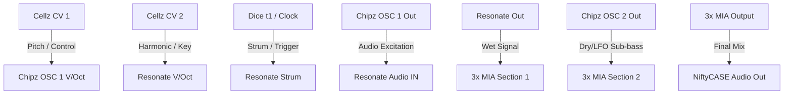

# Patch Guide: Resonant Chiptunes

This patch bridges the gap between the lo-fi digital grit of **Chipz** and the organic acoustic physics of **Resonate** (Rings clone), using **Cellz** as a playable controller and sequencer. 

By running Chipz through Resonate, you transform raw, buzzy chiptune waves into rich, plucked strings, hollow wood blocks, or metallic bells.

---

## The Concept: "Excited Physical Modeling"
Instead of using **Resonate**'s internal "virtual pick," we use **Chipz** as an **external exciter**. The sharp harmonic edges of the square or triangle wave from Chipz strike the virtual resonators inside Resonate, creating incredibly rich, hybrid acoustic-electronic textures.

---

## 1. The Setup & Patching

### Step 1: The Exciter (Cellz &rarr; Chipz)
*   **Patch:** **Cellz CV 1** $\rightarrow$ **Chipz OSC 1 V/Oct**.
*   **Patch:** **Chipz OSC 1 Out** $\rightarrow$ **ALA Resonate Audio IN**.
*   *What this does:* Cellz is now controlling the pitch of Chipz OSC 1, which will act as the "acoustic bow" or "hammer" striking Resonate.

### Step 2: The Resonator (Cellz &rarr; Resonate)
*   **Patch:** **Cellz CV 2** $\rightarrow$ **ALA Resonate V/Oct**.
*   **Patch:** **ALA Resonate Out** $\rightarrow$ **3x MIA Section 1, Jack A**.
*   *What this does:* Cellz CV 2 controls the resonant frequency (size/pitch) of the virtual instrument, while Chipz supplies the raw vibration. Since Cellz has dual outputs, you can program different pitches for CV 1 and CV 2 on each pad to create beautiful modal intervals!

### Step 3: The Strummer (Dice &rarr; Resonate)
*   **Patch:** **Dice t1** (or any Gate/Clock source) $\rightarrow$ **ALA Resonate Strum**.
*   *What this does:* The gate pulses from Dice will "pluck" the physical model, allowing the Chipz signal to ring out in gated, rhythmic bursts rather than a continuous drone.

### Step 4: The Sub-Bass (Adding Chipz OSC 2)
*   **Patch:** **Chipz OSC 2 Out** $\rightarrow$ **3x MIA Section 2, Jack A**.
*   *What this does:* Since Resonate absorbs the high frequencies and turns them acoustic, we can use Chipz's second oscillator directly into the mixer as a clean, low-frequency triangle wave to anchor the patch with a solid electronic sub-bass.

### Step 5: The Final Mix
*   **Setup:** Leave the outputs for Section 1 and Section 2 **empty** to cascade them down.
*   **Patch:** **3x MIA Section 3 Output** $\rightarrow$ **NiftyCASE Audio Out**.
*   **Mixer Adjustments:**
    *   **3x MIA Section 1 Knob:** Controls the volume of the organic, resonated sound.
    *   **3x MIA Section 2 Knob:** Controls the volume of the dry Chipz OSC 2 sub-bass.

---

## 2. Setting Your Knobs

### On ALA Resonate (Rings Clone):
1.  **Structure (12 o'clock):** This determines the physical model. At 12 o'clock, it emulates a vibrating string. Turn it fully left for modal beams (marimbas/bells) or fully right for sympathetic strings.
2.  **Brightness (1 o'clock):** Controls how bright and metallic the resonance is.
3.  **Damp (2 o'clock):** Controls the decay/ring-time of the resonance. Turn it up for a long ambient sustain, or down for dry plucks.
4.  **Position (11 o'clock):** Determines where the virtual string is being "struck".

### On Chipz:
1.  **OSC 1 Width (12 o'clock):** Turn this knob to hear how the harmonics going into Resonate change. A thinner pulse width creates a sharper, more delicate pluck; a wide square wave creates a heavy, woody strike.

---

## 3. How to Play This Patch

*   **Program Duets on Cellz:** 
    1. Touch a pad on Cellz.
    2. Turn the **Left Knob** to set the frequency of the Chipz exciter.
    3. Turn the **Right Knob** to set the frequency of the Resonate resonator.
    4. By setting them to matching pitches or perfect intervals (e.g., fifths or octaves), the physical model will sing in beautiful harmony.
*   **Friction and Bowing:** If you unplug the cable from **Resonate Strum**, the resonator is excited constantly by the Chipz drone. This creates a bowed-string or wind-instrument effect. Turn up **Damp** on Resonate and sweep Chipz's frequency manually to hear the resonator sing.
*   **Add Mojave for Space (Optional):** Route **3x MIA Section 3 Output** $\rightarrow$ **Mojave L (In)**, then **Mojave Out L/R** to the NiftyCASE outputs. Turn up Mojave's **Depth** to wash the resonant chiptunes in a gorgeous granular cloud.
