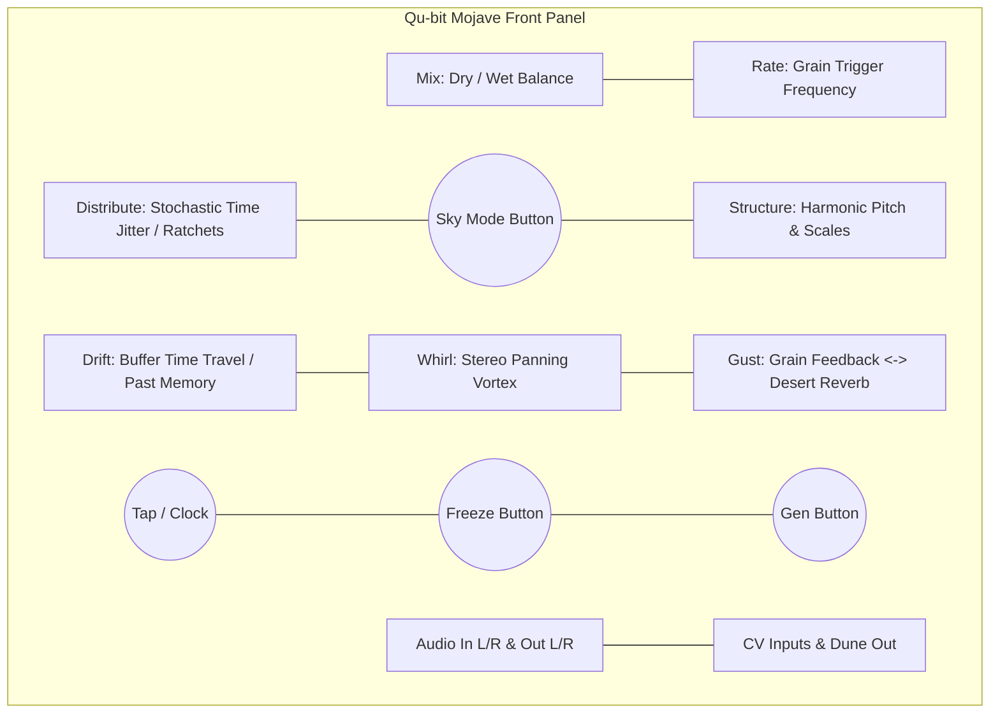
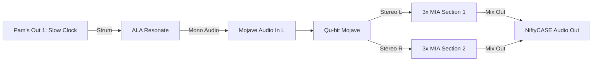
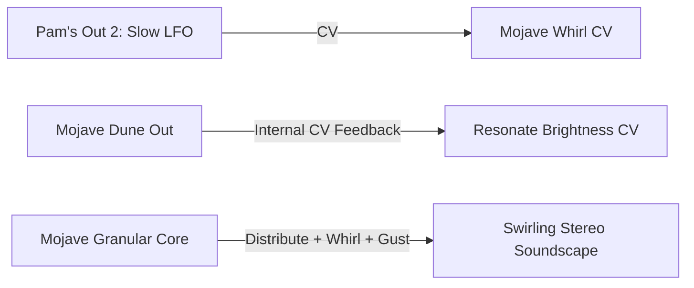
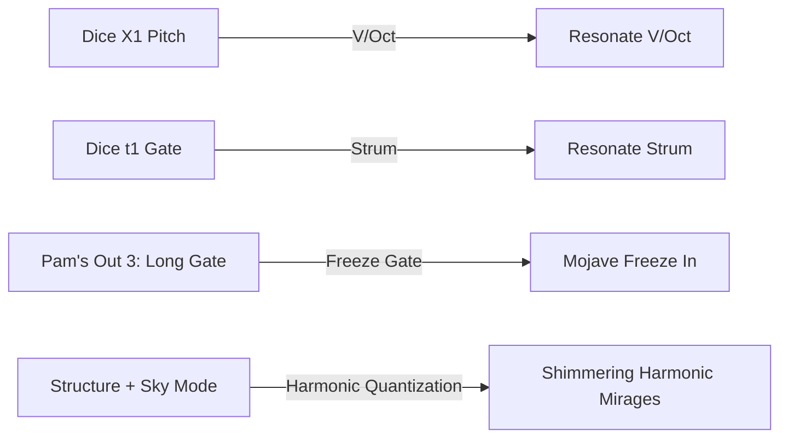
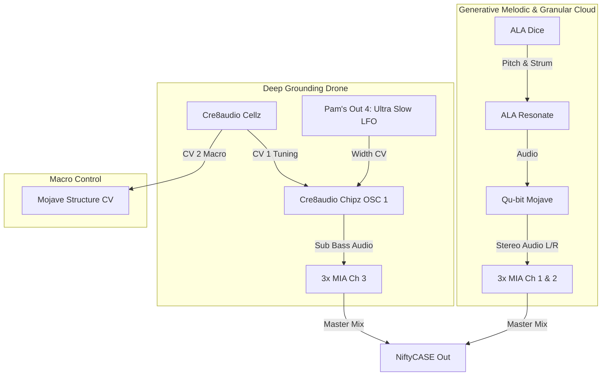

# Week 5: Ambient Soundscapes & Mastering Qu-bit Mojave (4-Day Patch Build)

Welcome to Week 5! This week's build is an ambient masterclass focused entirely on **Qu-bit Mojave**—a live granular processor and stochastic event generator inspired by the acoustic and atmospheric phenomena of the desert.

Unlike traditional granular modules that use complex academic parameters (like Window length and Grain speed), Mojave redesigns granular synthesis into **intuitive, desert-themed macro controls**: **Rate, Distribute, Structure, Drift, Whirl, Gust,** and **Mix**.

Across 4 daily 5-minute sessions, you will build a self-evolving, generative ambient biosphere, learning exactly what each knob on Mojave's panel does.

---

## The Mojave Front Panel Layout

Here is the exact layout of the controls on your Mojave:

### Mojave's Core Controls:
1. **Mix:** Sets the balance between the dry input signal and the wet granular cloud.
2. **Rate:** Sets how frequently grains are generated (from slow, sparse droplets to a dense wall of audio-rate sound).
3. **Distribute (Large Left Knob):** Adds stochastic (randomized) rhythmic displacement. In clock mode, it creates ratchets, rolls, and organic time-shifting.
4. **Structure (Large Right Knob):** Controls grain pitch. Low settings give subtle detuning/chorus; turning past 12 o'clock introduces quantized harmonic intervals, octaves, and shimmering arpeggios.
5. **Sky Mode Button (Center):** Cycles through Mojave's pitch quantization scales (Major, Minor, Pentatonic, Chromatic, Twilight/Unquantized).
6. **Drift:** Controls how grains traverse the audio memory buffer—causing grains to "slip into the past" and grab older audio fragments.
7. **Whirl:** Controls random stereo panning, scattering grains dynamically across Left and Right channels.
8. **Gust:** Multi-functional spatial processor: turning **Left** creates grain feedback/decay; turning **Right** opens a cavernous desert diffusion reverb.
9. **Freeze / Lock:** Locks the current audio buffer, turning transient sounds into an infinite, sustained pad.
10. **Dune Out:** Configurable CV/Gate output driven by internal grain movement.

---

## Day 1: Granular Foundations — The Desert Wind

**Goal:** Understand how Mojave captures and slices live audio using `Rate`, `Drift`, `Gust`, and `Mix` by feeding a simple chime from Resonate into Mojave.

### 1. The Sound Source (Clean Chime)
* **Patch:** Connect **Pam's Pro Workout Output 1** $\rightarrow$ **ALA Resonate Strum**.
* **Setup (Pam's):** Set Output 1 to a slow clock pulse (e.g., `/2` or `/4` modifier).
* **Tweak (Resonate):**
  * **Structure:** 11 o'clock (modal bell / acoustic string).
  * **Brightness:** 11 o'clock (warm, rounded chime).
  * **Damping:** 1 o'clock (moderate ring-out).

### 2. Route into Mojave (True Stereo)
* **Patch:** Connect **ALA Resonate Out** $\rightarrow$ **Mojave In L** (left mono input normalizes to right).
* **Patch:** Connect **Mojave Out L** $\rightarrow$ **3x MIA Section 1 Jack A**.
* **Patch:** Connect **Mojave Out R** $\rightarrow$ **3x MIA Section 2 Jack A**.
* **Patch:** Leave Section 1 output empty to cascade into Section 2, and connect **3x MIA Section 2 Output** (or Section 3 Output) $\rightarrow$ **NiftyCASE Audio Out**.

### 3. The 5-Minute Mojave Lab
Set **Distribute** and **Structure** fully counter-clockwise (off/neutral for now) to focus on the foundation:
* **Mix (2 o'clock):** Blend in mostly wet granular sound with some direct attack.
* **Rate (12 o'clock):** Listen as you sweep Rate. Fully left produces slow, discrete droplets of sound. Turning right blends grains into a continuous, silky drone.
* **Drift (11 o'clock):** Turn Drift up slowly. Notice how Mojave starts reaching backwards in time, pulling fragments of past Resonate chimes and weaving them behind the current note.
* **Gust (1 o'clock):** Turn to the right of center to introduce Mojave's lush diffusion reverb, washing the grains into an expansive space.
* **Gen Button:** Press the **Gen** button manually to trigger individual grain bursts on demand!

> [!TIP]
> **Daily Habit:** Spend 2 minutes tweaking `Rate`, `Drift`, and `Gust` until the chimes dissolve into a warm, tape-like granular trail. **Leave this patched for Day 2!**

---

## Day 2: Stochastic Weather — Sandstorm Dynamics

**Goal:** Transform static repeats into an organic, swirling 3D soundscape using Mojave's stochastic controls: `Distribute`, `Whirl`, and the generative `Dune` output.

### 1. Stochastic Timing (`Distribute`)
* In traditional delays, echoes land on rigid repeating time intervals. Mojave's **Distribute** knob injects random time displacement into grain firing.
* **Tweak (Mojave):** Turn **Distribute** to around 1 o'clock. 
* **Listen:** Notice how the rhythm dissolves from predictable pulses into natural, chaotic patterns—like sand blowing against glass or scattered raindrops.

### 2. Stereo Vortex (`Whirl`)
* **Whirl** dynamically throws individual grains across the stereo field between your left and right speakers/headphones.
* **Patch:** Connect **Pam's Output 2** $\rightarrow$ **Mojave Whirl CV**.
* **Setup (Pam's):** Set Output 2 to a slow Sine or Triangle wave (e.g., `/16` or `/32` division).
* **Tweak (Mojave):** Set the **Whirl** knob to 12 o'clock. As Pam's modulates it, grains will spiral across the stereo field in a rotating binaural vortex.

### 3. Generative Feedback Loop (`Dune` Output)
* Mojave's **Dune** jack outputs a dynamic CV voltage generated by the internal grain storm.
* **Patch:** Connect **Mojave Dune Out** $\rightarrow$ **Resonate Brightness CV** (or **Position CV**).
* **Result:** Whenever a dense cluster of grains swirls inside Mojave, the Dune voltage rises and opens the brightness filter on Resonate. The effect processor is now organically playing the sound source!

> [!TIP]
> **Daily Habit:** Put on headphones and listen to the swirling 3D spatial field. **Leave this patched for Day 3!**

---

## Day 3: Harmonic Mirages, Sky Modes & The Frozen Dunes

**Goal:** Introduce generative melodic sequences using **ALA Dice**, unlock Mojave's harmonic pitch engine (`Structure` & `Sky Mode`), and master **Freeze**.

### 1. Generative Melodies from Dice
* **Patch:** Unpatch Pam's Out 1 from Resonate Strum.
* **Patch:** Connect **Dice X1** $\rightarrow$ **Resonate V/Oct**.
* **Patch:** Connect **Dice t1** $\rightarrow$ **Resonate Strum**.
* **Tweak (Dice):**
  * Set **Steps** to 1 o'clock (repeating modal phrases with subtle variation).
  * Set **Spread** to 10 o'clock (keeps pitches within a pleasant 1-2 octave range).
  * Set **Rate** to a slow, meditative walking pace.

### 2. Harmonic Mirages (`Structure` & `Sky Mode`)
* **Structure** modulates the pitch of each grain:
  * Below 12 o'clock: Subtle detuning, chorus, and warm thickening.
  * Above 12 o'clock: Introduces octave jumps, fifths, and scale-quantized arpeggios that dance above the melody like a heat mirage.
* **Sky Mode Button:** Press the button between Distribute and Structure to cycle the LED color, changing the active musical scale (Major, Minor, Pentatonic, etc.).
* **Tweak (Mojave):** Set **Structure** to around 1 o'clock for lush, shimmering upper harmonics.

### 3. Freezing Time (`Freeze` / `Lock`)
* When **Freeze** is pressed, Mojave halts incoming recording and continuously granulates the buffer memory, creating an infinite ambient drone pad.
* **Patch:** Connect **Pam's Output 3** $\rightarrow$ **Mojave Freeze In** (or tap the front-panel button manually).
* **Setup (Pam's):** Set Output 3 to a slow gate pulse (e.g., `/32` clock division with high pulse width) to periodically freeze the soundscape into sustained chord pads.

### 4. The Acoustic Secret: Onboard MEMS Microphone
* Mojave has a high-quality MEMS microphone built directly into the front panel.
* **How to explore:** Unplug the cable from Mojave In L. Hold the **Clock Mode** button and turn **Mix** to adjust the mic gain. Tap the case rail, whisper, or snap your fingers—your physical room sounds will be instantly transformed into granular desert wind! Reconnect Resonate when finished.

> [!TIP]
> **Daily Habit:** Practice freezing a chord and turning `Drift` to explore different moments in frozen memory. **Leave this patched for Day 4!**

---

## Day 4: The Complete Ambient Biosphere

**Goal:** Complete the full 84HP system: Anchor the patch with a deep analog sub-bass drone from **Chipz**, use **Cellz** as an interactive touch controller, and balance the final master mix through **3x MIA**.

### 1. The Sub-Bass Grounding Drone (Chipz)
Granular clouds sound significantly deeper and more immersive when anchored by a warm low-end foundation.
* **Patch:** Connect **Chipz OSC 1 Out** (Triangle or Sine) $\rightarrow$ **3x MIA Section 3 Jack A**.
* **Patch:** Connect **Pam's Output 4** $\rightarrow$ **Chipz OSC 1 Width CV In**.
* **Setup (Pam's):** Set Output 4 to an ultra-slow Triangle wave (`/64` modifier) for subtle, breathing timbral shifts.
* **Tweak (Chipz):** Tune OSC 1 down into a deep sub-bass register.

### 2. Interactive Macro Control (Cellz)
Use Cellz's 16 touch pads as a live performance interface to steer the mood:
* **Patch:** Connect **Cellz CV 1** $\rightarrow$ **Chipz OSC 1 V/Oct** (touch pads to shift the root bass drone note).
* **Patch:** Connect **Cellz CV 2** $\rightarrow$ **Mojave Structure CV In** (touch pads to shift the harmonic scale and pitch intensity of the grains).
* **Performance:** Tune Pad 1 for a calm unison pad; tune Pad 4 for dramatic, high-register shimmering octaves.

### 3. Master Mix & Gain Staging (3x MIA)
* **Section 1 (Top):** Mojave Out L $\rightarrow$ Knob 1 set to ~2 o'clock (Left stereo channel).
* **Section 2 (Middle):** Mojave Out R $\rightarrow$ Knob 2 set to ~2 o'clock (Right stereo channel).
* **Section 3 (Bottom):** Chipz Sub Drone $\rightarrow$ Knob 3 set to ~11 o'clock (Warm, gentle low-end presence).
* **Final Out:** Connect **3x MIA Section 3 Output** $\rightarrow$ **NiftyCASE Audio Out**.

---

## Complete Patch Reference Card

| Source Jack | Destination Jack | Function |
| :--- | :--- | :--- |
| **Dice X1** | **Resonate V/Oct** | Generative quantized chime melody |
| **Dice t1** | **Resonate Strum** | Organic generative trigger |
| **Pam's Out 2** (`/32` Tri) | **Mojave Whirl CV** | Rotating binaural stereo vortex |
| **Pam's Out 3** (`/32` Gate) | **Mojave Freeze Gate In** | Automatic time-freezing drone cycles |
| **Pam's Out 4** (`/64` Tri) | **Chipz OSC 1 Width CV** | Breathing PWM timbre on sub-bass |
| **Mojave Dune Out** | **Resonate Brightness CV** | Closed-loop acoustic feedback |
| **Cellz CV 1** | **Chipz OSC 1 V/Oct** | Manual touch control over root bass note |
| **Cellz CV 2** | **Mojave Structure CV** | Manual touch control over grain harmonic pitch |
| **Resonate Out** | **Mojave In L** | Audio exciter into granular buffer |
| **Mojave Out L / R** | **3x MIA Ch 1 / Ch 2** | True stereo granular cloud mix |
| **Chipz OSC 1 Out** | **3x MIA Ch 3** | Warm sub-bass foundation |
| **3x MIA Section 3 Out** | **NiftyCASE Audio Out** | Final master audio output |

---

## 4-Day Performance & Play Checklist

* [ ] **Day 1:** Dial in `Rate`, `Drift`, and `Gust` on Mojave to turn Resonate chimes into smooth micro-loops.
* [ ] **Day 2:** Introduce `Distribute` and `Whirl` to transform rigid repeats into a swirling 3D desert sandstorm.
* [ ] **Day 3:** Unlock `Structure` & `Sky Mode` for harmonic shimmer and tap `Freeze` to lock chords into infinite pads.
* [ ] **Day 4:** Bring in the **Chipz** sub-drone and use **Cellz** touch pads to dynamically steer your ambient universe!
